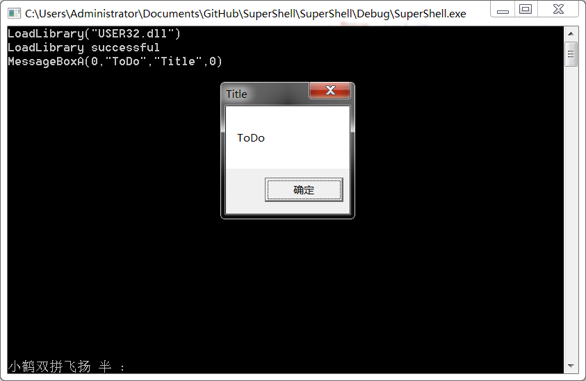

Super Shell is a shell.It excute command like you use C.
When you input `Enter`,it will run when your  input like c command.In future it's like:

```
//First Load  any one Library
LoadLibrary("USER32.dll")
//Input function name and argvs
MessageBoxA(0,"Something","Title",0)
```


Now it is like:



**Download it! Play it, Click it:**
[SuperShell.exe](https://github.com/dalerkd/SuperShell/tree/master/SuperShell/Exe/SuperShell.exe)